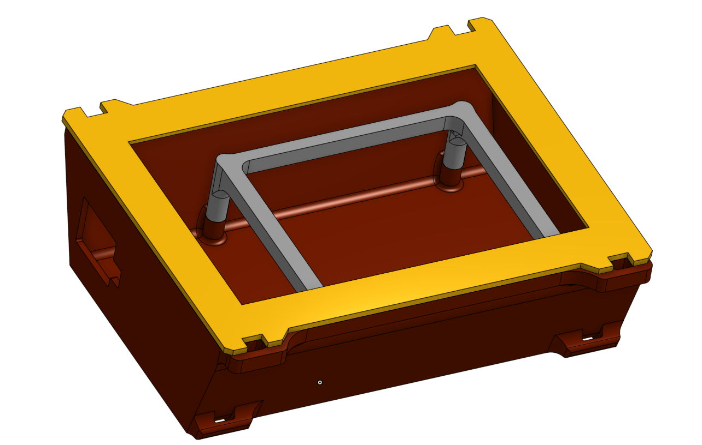

# motorcycle-GPS
Selfbuild GPS hack project for the apt Motorcyclist from 2018: Rasperry Pi 2 + Neo 6 GPS + Navit + 3D printed Case

This project started in 2018 after a 4400 kilometer bike ride to Montenegro/Albania/Greece and back.

