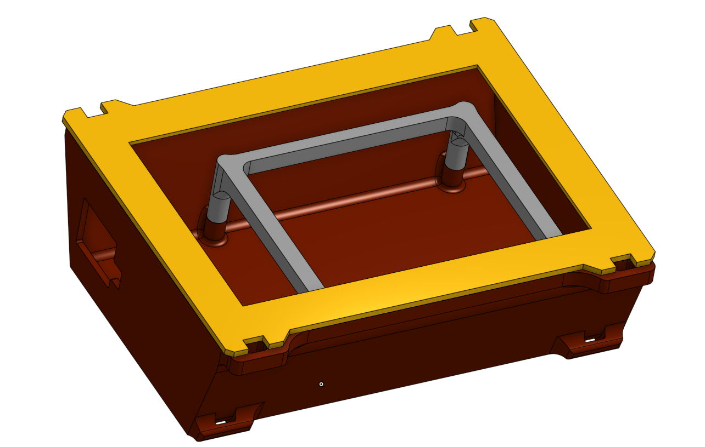

# motorcycle-GPS
Selfbuild GPS hack project for the apt Mmtorcyclist from 2018: Rasperry Pi 2 + Neo 6 GPS + Navit + 3D printed Case

This project started in 2018 after a 4400 kilometer bike ride to Montenegro/Albania/Greece and back.

todo: find all images from dead phone/ask friends

